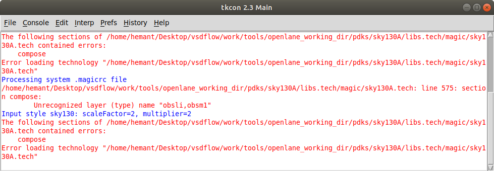

# SoC Implementation flow with pads, On-chip PLL block (avsdpll_3v3), and PLL control circuit.

chip_io config file   
  

soc flow config file    
  
  
  
but getting error during floorplan to see ioplacer.def in the tmp folder i use magic but getting error to load lib.tech file 

