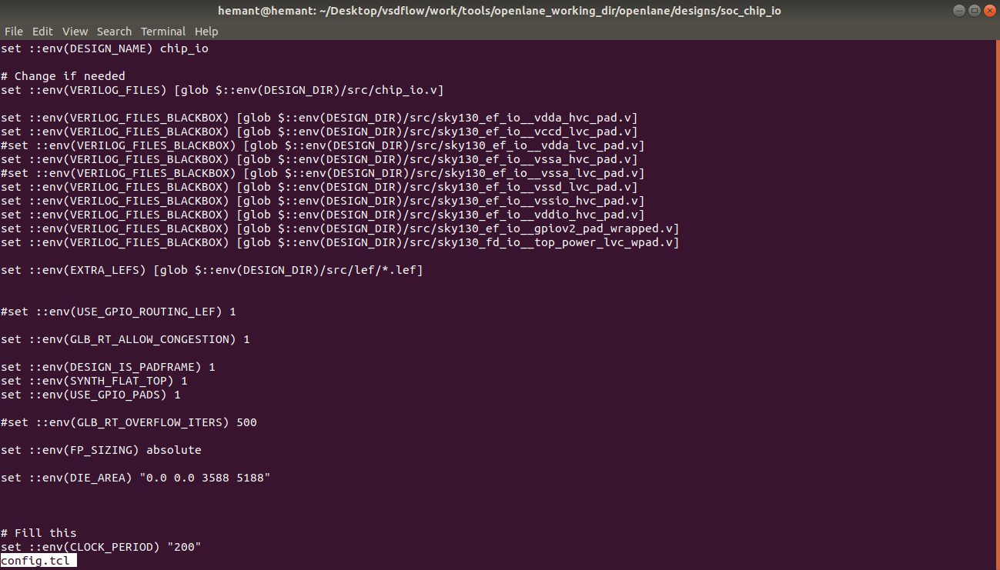
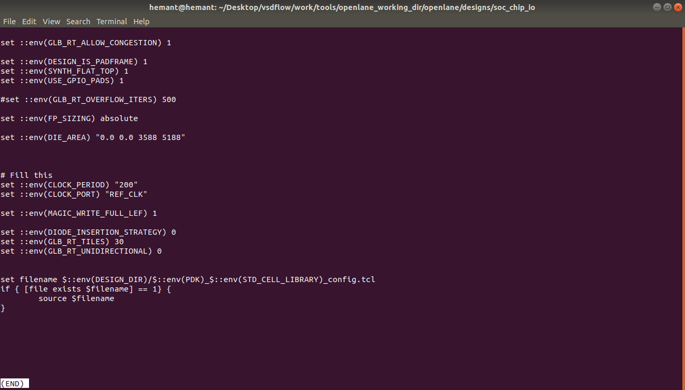
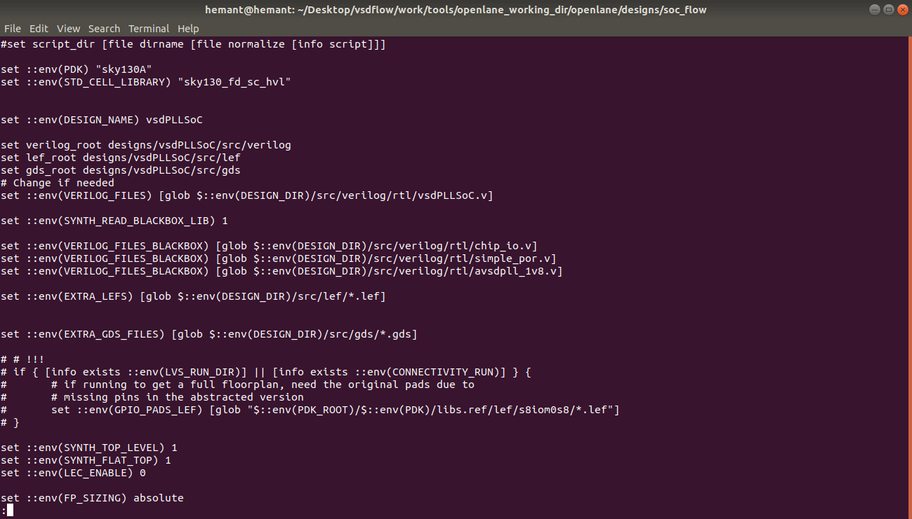
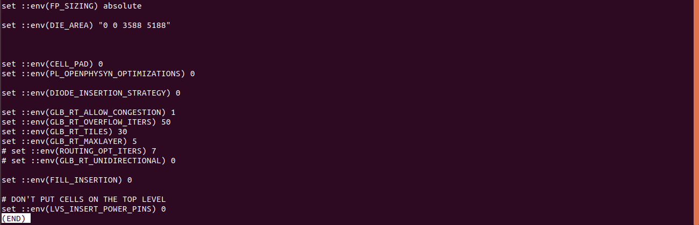
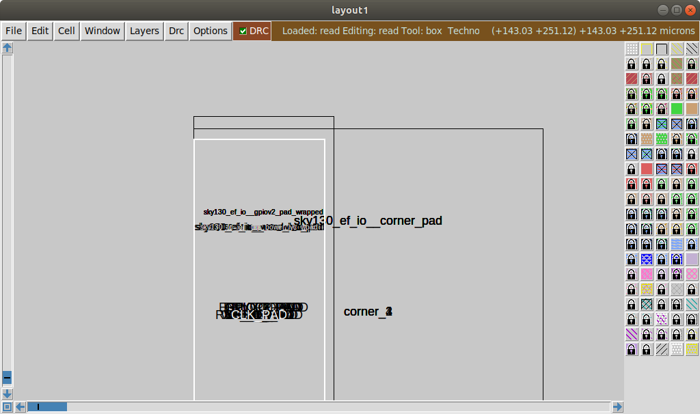
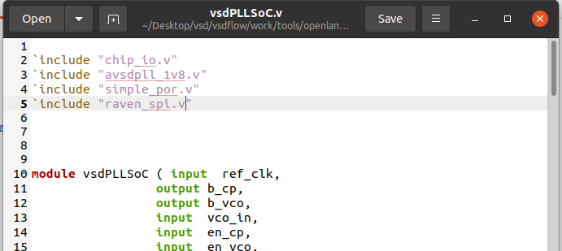
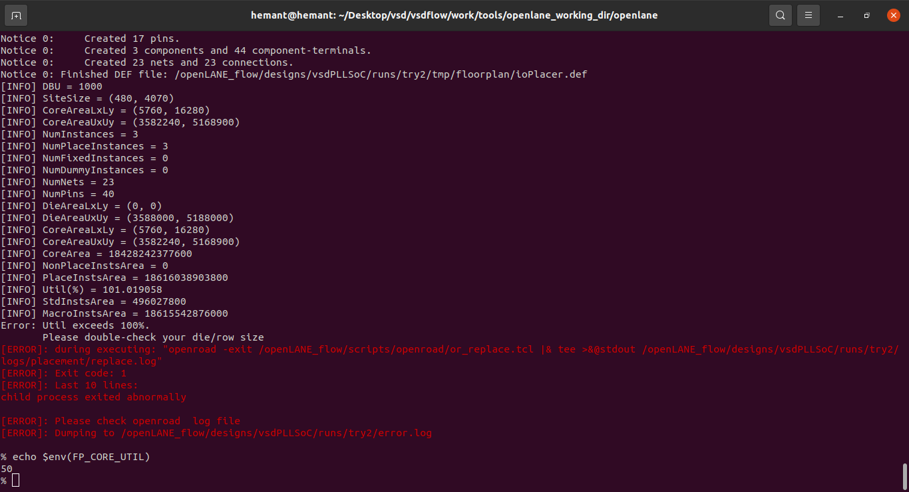

# SoC Implementation flow with pads, On-chip PLL block (avsdpll_3v3), and PLL control circuit.

chip_io config file   
  

soc flow config file    
  
  
 
<!---ioplacer.def is generated in tmp folder  
//iowarper pad all are accumulate at the corner
//   -->

To increase the instance count inseart ravan spi can find [here](https://github.com/hemant-gillurkar/vsd_soc_pll/blob/main/vsdPLLSoC/verilog/rtl/raven_spi.v)  
edited vsdPLLSoC found [here](https://github.com/hemant-gillurkar/vsd_soc_pll/blob/main/rtl/vsdPLLSoC.v)

 

`export PDK_ROOT=/home/hemant/Desktop/vsd/vsdflow/work/tools/openlane_working_dir/pdks`  

`docker run -it -v $(pwd):/openLANE_flow -v $PDK_ROOT:$PDK_ROOT -e PDK_ROOT=$PDK_ROOT -u $(id -u $USER):$(id -g $USER) openlane:rc6`   

`./flow.tcl -interactive`  

setup openlane package and prepare the design:
`package require openlane 0.9`  
`prep -design vsdPLLSoC -tag try2 -overwrite`  
 
 ## setup LEF file:
 `set lefs [glob $::env(DESIGN_DIR)/src/lef/*.lef]`  
 `add_lefs -src $lefs`   
 
 ## Synthesis
 `run_synthesis`  
 
 ## Floorplanning 
 `init_floorplan_or`  
 
 ## IO Placement 
 `place_io`  
 
 ## Placement 
 `global_placement_or`   
  facing the issue to reduce the core utilization area 
 
  
 
 
 ## interactive 
 if run commends [this](https://github.com/hemant-gillurkar/vsd_soc_pll/blob/main/vsdPLLSoC/script.tcl) in interative mode it generate the some tmp output but while runing the `run_floorplan` or following [this](https://github.com/praharshapm/vsdmixedsignalflow/blob/master/openlane/script.tcl)  it gives error while runing `global_placement_or` this as mentioned above.  
 
 
 after `run_magic` the results are stored in the [here](https://github.com/hemant-gillurkar/vsd_soc_pll/tree/main/vsdPLLSoC/results/magic) 
